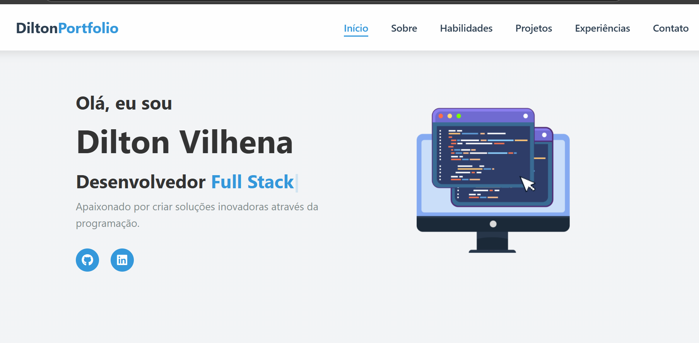

# Portfólio Full Stack Developer

 

## 📋 Sobre o Projeto
Portfólio profissional desenvolvido para demonstrar habilidades, projetos e experiências como Desenvolvedor Full Stack. O design é moderno, responsivo e otimizado para recrutadores.

## ✨ Funcionalidades
- ✔ Navegação suave entre seções
- ✔ Cards interativos de projetos
- ✔ Design 100% responsivo

## 🛠 Tecnologias Utilizadas
### Front-end
- HTML5 semântico
- CSS3 (Flexbox, Grid, Animations)
- JavaScript (ES6+)
- [Typed.js](https://github.com/mattboldt/typed.js/) (para efeitos de digitação)

